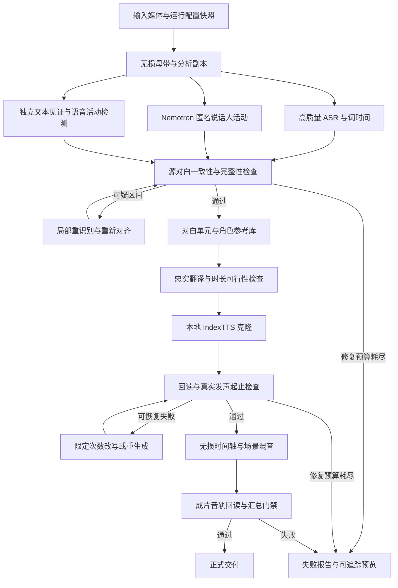

# VideoLingo-plus 自动配音流程优化方案

日期：2026-09-25。状态：用户已授权全阶段实施；阶段 0–6、模型对比与新成片验收 pending。执行与验收契约见第 11 节。

本方案依据当前工作区代码、现有《让子弹飞》运行产物、只读 CLI 检查及上游文档制定。当前工作区存在此前未提交修改，本轮不更改程序、配置或既有媒体。

## 1. 结论与适用边界

推荐路线：**无损音频准备 → 高质量词级 ASR → 独立文本见证与声学覆盖检查 → Nemotron 匿名说话人活动分析 → 不确定区间自动修复 → 稳定对白单元 → 忠实且符合时长的翻译 → 本地 IndexTTS 克隆 → 真实发声对齐 → 保留场景声音的混音 → 成片分层验收**。

正常任务不需要剧本、电影名称、人物名单、联网查台词或人工核验角色。系统使用 S01、S02 等匿名身份，解决“哪个声音在何时说话”，不推断演员或剧情人物姓名。联网台词仅是本次失败分析的外部线索，不进入生产依赖。

自动质量检查负责发现不一致、漏项、越界及明显异常；多模型一致不等于真值。不应把一致率、覆盖率或回读分数命名为“原片还原准确率”。达到自动规则的结果为自动验收通过，艺术表现与口型同步能力另行说明。

无需先替换 TTS、引入云语音服务或整体重写项目。保留共享 CLI、现有提供方适配器、stable-ts/WhisperX 词时间、Nemotron MLX、本地 IndexTTS、翻译来源检查和局部修复机制。

## 2. 本次重新核验的事实

| 项目 | 本轮证据 | 判断 |
|---|---|---|
| 运行状态 | run_id `20260925-183124`，CLI 显示 completed，pending_steps 为空 | 仅执行状态，不能代表质量通过 |
| 源 ASR | 配置 base、stable-ts、关闭 MLX；任务中存在大量错字和语义异常 | fail；模型容量是高优先级调查方向，CPU 本身不是低准确率的证据 |
| 说话人覆盖 | 374/380 词有标签，98.42%；3 个匿名声音 | 标签覆盖统计有效，身份正确率 unknown |
| 未知说话人任务 | 第 2、3、32、33、34、35 条，共 6/35，即 17.14% | 词覆盖掩盖了任务级风险 |
| 源内容覆盖 | source_asr_coverage.json 为 fail；声学模式 37/38 个合格 turn；170.04–170.50 秒重识别后仍未覆盖 | 未解决的候选缺口，须自动区分语音、音乐/噪声误报；不能直接当作已漏掉一句台词 |
| 短片段 | 第 32、33 条原始窗口为 60 ms、240 ms | 不适合直接作为独立英文配音窗口；不代表这些音节应被删除 |
| 时间冲突 | new_sub_times 中 32/33 重叠 240 ms，32/34 重叠 39 ms | 存在实际计划窗口重叠；音频听觉重叠程度尚未独立测量 |
| 说话人边界报告 | cross_speaker_rows=1，status 仍为 pass | 规则没有按该异常阻断；该行的具体声学真值 pending |
| 配音评分 | 35 条，29 ok、6 warn、0 fail；均分 0.9418；quality_gate.passed=false | 当前成片质量门禁 fail |
| 配音警告 | 低内容分 4 次、越长 1 次、语速过快 2 次；同一行可有多项原因 | 7 个原因不能解释成 7 条失败行 |
| 翻译来源 | GLM-4.5-Air；stale_stage_count=0 | 来源一致 pass，不代表翻译语义正确 |
| 通用产物来源 | 15 个检查点条目全部缺少通用 sidecar manifest | 来源验证 pending；不能由此推断已有独立 LLM manifest 也不存在 |
| 源与成片 | 源 170.852426 秒，成片 170.852000 秒 | 容器时长一致；不代表对白同步 |
| 音轨规格 | 源 44.1 kHz 双声道；成片 16 kHz 双声道 | 成片发生采样率降低 |
| 环境检查 | stable_whisper、Nemotron、IndexTTS 入口正常；pip-check 失败；部分未用 TTS 后端不可用 | 核心入口可读，整体 doctor 非全绿；不可用的备用 TTS 不是本次错配根因 |

既有台词推断需要纠正：前次摘要称第 30 条应从 S03 改为汤师爷，但重新查到的[公开台词整理](https://www.bilibili.com/opus/922853214827577364)把“等三天”这句列给张麻子。因此该纠正没有充分依据，不应写入规则。公开整理本身也不能替代此剪辑的真实声学证据。生产方案完全不依赖该人物映射。

## 3. 根因链与修复优先级

### 3.1 P0：错误文本进入下游，后续评分验证了错误目标

当前任务第 13 条的中文含“大一面亲”等错误，英文出现 `First Front Army`；这条英文的回读分却为 1.0。第 26 条的英文包含 `First execute him, then me`。这些现象说明，回读准确与翻译忠实是两项不同要求。

必须分开检查：源语音内容可信度、翻译语义保持、TTS 是否读全、最终混音是否仍可听清。当前系统主要具备后两者中的片段级内容检查，缺少前端准入。

### 3.2 P0：低置信度说话人被强制单标签化

`speaker_diarization.py:125` 对词区间平均概率取 argmax；未充分表示多通道同时活跃、第一/第二候选接近等情况。概率低时还会按 turn 重叠/最近距离分配标签，可能把“不确定”变成“看似已覆盖”。

Nemotron 输出活动概率与匿名到达顺序标签，最多 8 个通道；它不提供人物姓名，10 ms 输出分辨率也不等于 10 ms 真实边界误差。[MLX 模型卡](https://huggingface.co/mlx-community/Nemotron-3-Diarization-8bit)、[NVIDIA 模型卡](https://huggingface.co/nvidia/Nemotron-3-Diarization)。

### 3.3 P0：微片段溢出放行，导致计划时间冲突

Step 10 的 `<300 ms` 分支允许超出自然语速后的音频扩大窗口，Step 11 又允许微窗口越界叠加。第 32 条把 60 ms 扩展到 339 ms，从而与后续两条相交。

根治位置在源语音单元和 TTS 任务生成之前。撤销临时放行应与微片段修复一起上线，单独撤销只会恢复报错。

### 3.4 P0：失败证据未汇总为交付门禁

当前 `speaker_diarization.required=false`、source coverage required=false、translation require_speakers=false，覆盖下限降为 0.80。cinematic profile 没有完整重设这些约束，也没有保证高质量源 ASR。

`apply_speaker_diarization()` 先写入 `report['source_coverage']`，随后把 report 整体替换为词对齐结果，丢失这部分汇总。Nemotron 主后端把无文本的 Nemotron 分段送入覆盖检查，文本见证未独立执行。shadow 与主后端同为 nemotron-mlx 时分支直接跳过，不会形成对照。

Step 11 写评分但没有据此拒绝最终合成；runner 在步骤未抛异常时标 completed；Step 12 的最终 ffmpeg 调用没有 `check=True` 或等效返回码检查。质量失败与渲染失败都可能无法可靠传到最终状态。

### 3.5 P1：文字纠错、断句和时间轴缺少统一关联

Step 4 普通纠错要求每行字数不变，限制了真实漏字修复；精确替换又可以改变字数，并依赖 Step 6 重新模糊匹配。原 ASR 已错时，永久保留其错误词边界不能保证同步。Step 8 仍直接删除连字符和括号内容，有损伤数字范围和有效台词的风险。

### 3.6 P1：音色参考的“文件有效”标准不足

参考音频主要按文件大小、时长和接近 5 秒选取，缺少独立的有效语音占比、重叠比例和说话人纯度检测。相邻行扩展依赖任务标签；主参考存在即可返回，标签错误不会被发现。严格同说话人回退主要保护已知角色，未知角色没有可靠安全出口。

### 3.7 P1：填满窗口被误当作发声同步

Step 10 在语音尾部补静音，`dubbing_quality.py:222` 的 actual_start/end 来自 new_sub_times。第 11 条 real_dur 约 5.86 秒，导出窗口约 11.84 秒，时长比例仍接近 1。这个比例不能说明台词的发声起止、重音、内部停顿与原音一致。

### 3.8 P1：音频链路损失与混音策略改变了原片氛围

`audio_preprocess.py` 先把源音频转为 32 kHz 单声道 MP3；Demucs 背景/人声导出 MP3；增强后再次编码 MP3；Step 11 最终配音强制 16 kHz 单声道、64 kbps MP3。最终混音没有显式规定高质量输出采样率。

Step 12 用 TTS 窗口决定哪里删除原声，未覆盖的源对白可能保留原语言，窗口过长又会替换本应保留的环境声音。背景先乘 0.35，再通过 ratio=8 的侧链压缩，存在背景被过度压低的风险，具体听感贡献 pending。

配置名 loudness_target_lufs 实际通过 AudioSegment.dBFS 实现，二者不等价。需要真实响度测量，不能继续按错误单位判断合格。

### 3.9 P1：缓存、测试和模型来源存在证据漏洞

检查点大量采用“文件存在/目录非空/列存在”；仅更换 ASR 配置可能继续复用旧识别文本。已有 manifest 组件尚未全面接入恢复决策。

当前 `speaker_diarization_shadow.json` 只有 4 个词，evidence_dir 指向 pytest 临时目录；对应测试只隔离主报告，生产代码把 shadow 写到固定 output 路径。这份 shadow 是测试产物，不能用来评价本视频。

Nemotron 配置记录了 revision，但 provider 没有把 revision 交给 runner，runner 直接按模型名 load。记录 revision 不等于实际固定权重。preset 设置失败只发 warning，报告仍显示请求的 preset，需要补实际生效参数。

## 4. 目标流程：全自动闭环

正常路径全部自动执行。失败结束不要求每个任务由用户核对角色，也不把失败包装成成功。可以保留带状态说明的预览；正式成片只在约定门禁通过后交付。生产中的 unknown/overlap 应被保留为数据状态，不能通过删词或强行归类来提高覆盖率。

## 5. 推荐模型与职责

| 环节 | 推荐选择 | 自动降级与限制 |
|---|---|---|
| 源中文 ASR | stable-ts + MLX Whisper large-v3，作为质量优先候选 | large-v3-turbo 作速度对照与可选 fast profile；用同一任务 A/B 后确定正式默认 |
| 源词时间 | stable-ts/WhisperX 声学词时间 | 修正文本后局部重新对齐，保留原版本；不能把句时间平均分配成词时间 |
| 说话人活动 | Nemotron-3-Diarization-8bit，离线参数，固定权重版本 | 低置信度、重叠、多于支持的说话人数量必须暴露；长视频保持流状态或做跨块身份关联 |
| 内容见证 | 先复用当前本地 Qwen3-ASR 路线作独立文字对照 | 对中文源声音的实际能力先做 smoke；MOSS 通过文件读取与真实中文音频测试后作为可替换见证/影子后端 |
| 翻译 | 暂留现有可追踪的 LLM 路线 | 先修源输入与语义约束；证据表明翻译模型仍不足时再进行模型对照 |
| 配音 | 保持本地 MLX IndexTTS，明确记录实际 profile/模型版本 | 按同一匿名角色重试；已有备用克隆后端仅在一致性检查通过后启用 |
| 目标回读 | 当前 Qwen3-ASR 命令适配器 | 报告真实模型为 Qwen3-ASR-0.6B-8bit，不能被配置中的 large-v3-turbo 字段误导 |
| 最终音频 | 无损中间件 + 显式采样率 + 最后一次 AAC 编码 | MP3 仅保留为兼容或预览导出，不再作为成片混音母带 |

Whisper 官方说明 turbo 侧重速度，准确率与 large-v3 存在权衡；官方速度数据不能直接套用到本机。此项目使用中文 transcription 再由 LLM 翻译，避免把 turbo 当作直接语音翻译模型。[Whisper 官方说明](https://github.com/openai/whisper#available-models-and-languages)。

MOSS 内容检查与 MOSS-TTS 是不同能力。doctor 中 MOSS-TTS 缺目录不能证明 MOSS 转录不可用；配置注释记录了 MOSS 读取 WAV 的问题，本轮未重现，状态为待验证。不能把未经验证的 MOSS 设置成所有任务的单点必需依赖。

## 6. 分阶段详细实施

### 阶段 0：隔离与可追踪基线（P0，所有后续阶段的前置）

- 保留现有失败 output；新实验在独立 run 目录运行，不移动或覆盖当前媒体。
- 引入运行上下文：run_id、输入媒体 hash、实际配置快照、提供方/权重版本、代码版本、产物父依赖、门禁策略版本。
- 第一阶段可通过隔离运行目录兼容现有相对 output 路径；随后逐步把路径收敛到统一上下文，避免一次性改完全部模块。
- 修复测试写真实 shadow 报告的问题；所有涉及输出、音频清理、环境变更的测试使用临时根目录。
- 将 completed 分为执行完成和质量状态；总状态建议采用 running、rendered、accepted、failed，质量数据另外保留 pass/fail/pending/not_applicable。
- Step 12 检查退出码、产物可解码、媒体时长及预期音轨。使用临时文件生成，全部检查通过再发布本次运行产物。

交付：独立运行目录、只读基线摘要、测试隔离修复、可靠退出状态。验收：模拟 ffmpeg 失败、报告缺失、上游 hash 变化时，不得出现 accepted 或跳过受影响步骤。

### 阶段 1：音频准备与源 ASR 质量（P0/P1）

- 直接从源媒体保留原采样率/双声道的 PCM 或 FLAC 母带；从母带派生 16 kHz 单声道分析副本。
- Demucs 使用高质量输入，背景和人声保存无损。保留原混音、人声、受控增益人声三路的来源关系和时间偏移。
- 去掉固定 2.5 倍放大作为必经步骤，改为有峰值约束的可选增益；检查峰值、削波和编码延迟，不能假定增强一定更好。
- 提高 ASR 容量，保留原始文本、词 ID、置信度/可用的识别统计、开始结束、模型和音频变体。模型不提供的置信度留空。
- 独立见证只提供文本异议和区间，不替换主词时间。声学覆盖使用区间并集，防止重复词窗口重复计算覆盖。
- 自动触发局部重识别的条件：文本差异大、重复退化、语音存在而无词、低置信度、单字碎裂、词持续时间异常、换人处跨界。
- 每个疑点最多 2 轮：换音频视图并扩大上下文 → 高质量模型重识别/重对齐；持续不一致标 unresolved_source。
- 项目术语从任务内高置信度反复出现的文字中提取并限制使用；可接受用户提供词表，但不要求。历史影片/商品词表不进入全局默认。

对比方式：先固定一个音频视图比 base、large-v3-turbo、large-v3，再固定胜出模型比较音频视图，避免同时改变所有变量。开发评估可用带参考转录的离线测试集；正常任务只用声学与多路一致性证据，不宣称计算了真实 CER/WER。

交付：source_asr_evidence、acoustic_coverage、text_witness 三份独立报告与修复记录。验收：源覆盖失败必须传递到总状态；同一输入可重放；改 ASR 模型后不得复用原 ASR 结果。

### 阶段 2：无人物名单的说话人一致性（P0）

- 保留逐帧多通道活动；词级输出包含候选 speaker、支持比例、top1/top2 差距、overlap_fraction、boundary_confidence。
- 在词区间内按有效语音帧累计证据；低置信度不通过最近邻自动变成高置信度。输出 confirmed、ambiguous、overlap、unknown 四类状态。
- 对短句使用前后上下文整体重算，比较局部/全局分段的一致性；局部运行的 S01 不得直接当作全局 S01。
- 先通过与全局重叠区间的活动对应关系进行局部标签匹配；仍无法匹配时可增加源语言声纹嵌入校验。声纹阈值需要离线标定，不能直接套用跨语言阈值。
- 全局匿名身份对应多个干净语音锚点；不同情绪、远近距离的样本可以并存，但必须支持同一声音的一致性。
- 把词级覆盖、任务级覆盖、按时长加权覆盖、未知/歧义比例、身份漂移候选、跨说话人任务数量分别报告。
- 主后端与 shadow 相同视为无效配置；内容见证独立配置，不能依附 shadow 才执行。
- 真重叠不是错误。自动可靠分离且能够对齐时使用独立轨道；现有单声道混合无法可靠拆出两套文本时，标 unresolved_overlap。不能把多声道概率直接当成已分离的干净语音。

交付：匿名 speaker_registry、词与 turn 关联报告、局部重跑映射证据。验收：低置信度不得被静默强贴角色；已接受的普通单人对白单元不得混入第二说话人；支持上限外的数据不伪装成可信聚类。

### 阶段 3：统一对白单元，修复微片段和对齐（P0）

- 建立 utterance_id 及其 source_word_ids，使每条翻译、参考、TTS、字幕、时间轴和报告都能追溯到同一源对白单元。
- 字幕排版、配音断句是该单元的不同视图；不再靠多次模糊文本匹配重新猜关联。
- 一个单元默认属于一个确定匿名说话人，允许多个子短语和内部停顿；禁止把人物轮换当作普通分句合并。
- 小于 250 ms 是自动复查信号，不是删除规则。确认同一说话人、连续语义及相容声学活动后，与相邻词/短句合并；真实短促回答保留；换人处局部重识别；有证据表明无语音的幻觉才可抑制并留记录。
- 对未知说话人微片段，先修身份与原文，再决定合并，不使用“最近已知 speaker”直接填补。
- 文本纠正修改词数时，做声学重新对齐并生成新版本；未经校验的旧时间不能被当作新文字的精确时间。
- 把 native-transcription 与 forced-alignment 的时间来源分别记录，验证器明确接受经过质量检查的词级声学对齐；保留原 ASR 版本，禁止线性均分句时间。
- 修复 Step 8 连字符/括号清洗；语义文本与用于语音生成的标准化文本分别存储，保留转换记录。
- 用稳定 ID 逐步替代 Excel 作为唯一真源，先增加 JSON sidecar 和兼容导出，不要求一次性迁移全部表格。

stable-ts 上游提供 align/align_words，但当前 MLX 路线的具体兼容性仍需 smoke 验证，必要时走独立对齐适配器。[stable-ts 对齐文档](https://github.com/jianfch/stable-ts#alignment)。

交付：utterances 数据、微片段决策记录、对齐质量报告；同时撤除 Step 10/11 微窗口越界放行。验收：不再出现“了、人、了、人”直接各生成一条英文的默认行为；有效短句不会因时长阈值被静默删除。

### 阶段 4：自动参考库、语义翻译与局部时长适配（P1）

- 每个匿名说话人建立参考库，优先 3–8 秒有效语音作为初始候选范围；依后端实际要求调整，不用整段长度代替有效语音长度。
- 自动评分包含：单说话人纯度、重叠比例、有效语音占比、信噪代理、削波、声纹一致性。先过滤，再排名；候选只有噪声或多人声时不得借用其他身份。
- 身份参考与情绪参考分别管理。身份参考固定音色，情绪参考优先当前同一声音的上下文；使用 IndexTTS 已支持的能力，并保存实际参数。
- 翻译输入含匿名角色、相邻对白、称谓上下文、源词关联与时间预算；无需知道剧情人物姓名。
- 先生成忠实语义版本，再生成时长可行版本。自动检查数字、否定、施事/受事、人物称呼、重要动作、疑问/命令语气与重复强调是否被改变。
- 短句无需为了铺满空隙而添加内容；反复追问在影片中可能表达情绪递进，不能机械去重。
- TTS 自然生成并测量实际发声时长后，按“借用同一说话人的可用空隙 → 不改含义的简化表达 → 重生成 → 小幅变速”顺序修复；不得跨越下一个角色或明确事件边界。
- 暂保留现有 1.12x 常规自然语速上限作为起点；短句阈值单独标定，不能凭 `<300 ms` 放行，也不能仅凭 1.35x 以下就判自然。
- 改写/重生成每条最多 2 轮，总尝试次数统一累计，避免各模块各自循环导致乘法式重试。
- 备用后端使用同一角色参考；整个角色的一致性优先于孤立行低分回退。回读歧义先复核，避免单词音频被识别器误判而无休止再生成。

交付：reference_manifest、语义检查报告、TTS 实际后端与参考指纹、修复历史。验收：所有 accepted 台词有确定参考来源；自动缩写不改变关键语义；未知身份不得进入任意参考音色回退。

### 阶段 5：真实发声对齐与场景混音（P1）

- 分别存储硬窗口、自然语音长度、变速后有效发声区间、静音填充；不再将文件末尾作为实际说话末尾。
- 通过 VAD/能量与目标回读对齐相互校验生成语音起止；评估头尾遗漏、内部长静音、关键节奏和下一角色的抢占。
- 用源对白活动决定原语言人声移除范围，用生成语音活动决定配音位置。两者不共用“已填充的 TTS 窗口”。
- 全片声学语音区间都需要可追踪处置：已配音、非语言声音保留、源识别未解决、重叠未解决。出现未覆盖候选必须自动复查，不能直接保留原语言后宣布完成。
- 背景/音效保持无损双声道；分离残差、笑声、呼吸与环境事件单独考虑。低置信度非语言事件不应被生成为台词。
- 区间拼接使用短交叉淡化（初始 20–50 ms，避开爆破音），避免硬切和压缩器引起突变；有时延的滤镜须补偿。
- 去掉固定背景 0.35 加强侧链作为唯一策略，按对白清晰度和场景动态自动调整；保留枪声、脚步等事件的相对位置与瞬态，具体规则经离线场景回归确定。
- 真正使用 LUFS/true peak 测量；建议初始完整混音目标约 -18 LUFS、容差 ±1 LU、true peak ≤ -1 dBTP，作为项目提案而非普适标准；后续按交付渠道调整。不要逐句等响压平人物情绪。
- 中间使用 PCM/FLAC；混音统一 48 kHz 双声道或保留合适母带规格，最后一次 AAC。升采样不会恢复已有丢失信息，必须从源母带重建才有意义。
- 读取最终 MP4 音轨做回读、可听性、响度、音画起始偏移和文件解码检查；片段 WAV 通过不能替代成片通过。

FFmpeg 的 loudnorm 支持响度范围和真实峰值约束及单/双遍处理；具体参数需用实际素材标定。[FFmpeg 官方文档](https://ffmpeg.org/ffmpeg-filters.html#loudnorm)。

交付：无损配音母带、speech_timing_eval、mix_eval、final_eval；预览 MP3 与成片分别导出。验收：非预期重叠为零、源语音无未解释缺口、音效事件无系统性漂移、最终音轨规格明确。

### 阶段 6：缓存、性能和长期回归（P1/P2）

- 依赖指纹按阶段计算：媒体 → 音频视图 → ASR → speaker/utterance → 翻译 → 参考/TTS → 混音/交付。修改 ASR 必须使所有依赖它的结果失效；修改混音只重做混音及最终评估。
- 指纹绑定内容 hash、语言、模型实际权重、相关参数、参考音频内容、上游版本、门禁版本。文件路径或 mtime 不够。
- 模型 revision 必须解析为固定本地快照再交给 loader；保存实际 resolved revision。记录 requested/effective preset，不支持的参数应报配置错误。
- source_report、speaker_report、shadow_report 不互相覆盖；每份带 run_id、输入 hash 和报告种类。测试报告不得被生产读取。
- 本机重型 MLX 模型默认串行调度，CPU 预处理和受限 LLM 请求可并发；根据峰值内存调并发，不盲目同时常驻所有模型。
- 尽可能批量回读并复用模型进程；首次完整源检查后，只对可疑区间做额外识别。记录每阶段耗时、模型加载、纯推理、I/O、重试数和峰值内存。
- MLX 性能计时必须确认计算完成；冷启动和热运行分别报告。旧报告的极高热运行加速比不可直接作为总流程速度承诺。
- doctor 按本次路线区分 required 与 optional。修复当前 NumPy/OpenCV 依赖冲突应在隔离环境验证，不在稳定 ASR 环境里盲目升级 NumPy。
- 更新项目文档中旧的 MOSS 必需默认、读回后端、completed 意义；保留旧成果为历史证据，当前路线必须有独立状态。

## 7. 自动门禁与验收定义

以下数值是待标定的初始提案，均不是本轮实测成绩。正式门禁还要看异常是否解释清楚，不能只靠一个平均分。

| 层级 | 自动规则 | 不满足时 |
|---|---|---|
| 输入 | 可解码、时间基明确、母带可追溯、必需提供方 smoke 通过 | 阻断依赖阶段，给具体失败原因 |
| 源语音完整性 | 按语音区间并集计算，建议 ≥99%；所有 >300 ms 的候选缺口逐一自动复查 | 局部恢复，预算耗尽则 fail；短于 300 ms 也不能无依据忽略 |
| 源文本 | 两路文本差异、置信度、重复异常综合检查；没有高严重度未解决分歧 | 换视图/重识别；不能把一致度当 CER |
| 说话人 | 词覆盖建议 ≥98%；accepted 的普通配音单元身份明确；无未经处置的跨人合并 | 重算/拆分；unknown 和 overlap 单独报告 |
| 微片段 | 没有未经处理的 <250 ms 独立普通 TTS 任务 | 合并/重识别/有证据抑制；真实短促声音按专门类别处理 |
| 翻译 | 无未解决的数字、否定、角色关系、关键动作反转；改写不丢核心信息 | 局部重译，保留版本与理由 |
| TTS 内容 | 目标回读分初始 ≥0.88，加头尾完整性、语言检查；短句采用额外上下文复核 | 有界重生成，不以低分单独判定必错 |
| 时间 | 普通单轨无越界重叠；真实发声起止初始容差约 120/180 ms，按短句/长句标定 | 重排同角色可用空隙/改写/重生成 |
| 音色 | 同角色参考纯度和一致性通过；不使用其他匿名身份补缺 | 重选参考/重生成；缺证据不宣称音色相似度通过 |
| 混音 | 最终可解码、规格符合配置、无削波；声学覆盖候选全部有处置 | 修混音或返回源阶段 |
| 交付 | 全部必需 gate 为 pass；pending 与缺报告不能转换为 pass | 状态 failed 或 rendered，输出问题定位与预览 |

真实 CER/WER、DER/JER、说话人归属准确率需要有参考标注，只能在离线回归集上计算。生产无标注任务报告的应是内部一致性、异常数量和覆盖情况。两者独立存储。

离线回归集建议至少覆盖：单人口播、两人快接话、三人对白、BGM 强、方言、耳语/喊叫、真实重叠、长视频、纯静音、数字和重复短语。使用已有标注或专门测试素材，避免每个新用户视频都需要人工标注。

## 8. 修改范围与最小验证

| 工作包 | 主要现有模块 | 关键回归 |
|---|---|---|
| 状态与证据 | pipeline/runner.py、artifacts.py、artifact_manifest.py、step_checker.py | 模型变化失效；缺报告不通过；渲染错误不 completed |
| 无损 ASR 输入 | audio_preprocess.py、demucs_vl.py、stable_ts_local.py、step2_whisperX.py | 采样率/声道；时间偏移；模型与视图指纹；词置信度保留 |
| 内容与说话人 | source_coverage.py、speaker_diarization.py、nemotron 两个适配模块 | 低分保留 unknown；真重叠；局部标签重映射；报告不覆盖 |
| 对白与时长 | step3、step4、step5、step6、step8 两个模块 | 稳定 ID 传递；跨人边界；变长纠错重对齐；短句不误删 |
| 参考和 TTS | step9、tts_utils.py、mlx_tts.py、step10 | 干净参考选取；未知身份不任意回退；有界重试；源文本不被时长修复破坏 |
| 合成与评价 | step11、step12、dubbing_quality.py、quality_gate.py | 无溢出例外；静音填充不能冒充同步；最终音轨回读；LUFS 与采样率 |
| 测试隔离 | test_speaker_diarization.py、相关音频与修复测试 | 运行前后真实 output 清单/hash 不变 |

优先扩展现有回归文件，包括 test_source_coverage、test_speaker_diarization、test_step6_timeline_alignment、test_tts_reference_selection、test_step10_gen_audio、test_step11_merge_audio、test_step12_merge_video、test_dubbing_quality、test_artifact_manifest 与 test_cli_workflow。先修输出隔离再运行可能写文件的测试。

## 9. 实施顺序、对照与回退

1. M0：阶段 0，可靠证据与运行隔离。后续每一步都能观察真实改善。
2. M1：阶段 1–3，输出可信源对白和匿名身份。此时再进入翻译/TTS，避免在错误输入上消耗生成时间。
3. M2：阶段 4，完成语义与音色闭环，产出通过片段门禁的自然语音。
4. M3：阶段 5，完成场景混音与最终音轨验收。
5. M4：阶段 6，基于 M1–M3 的稳定路径做性能、缓存与多素材推广。

对照保留 A 当前失败基线、B 仅源识别优化、C 加说话人/对白单元、D 加参考/TTS 优化、E 加无损混音与最终验收。每组记录输入 hash、实际参数及报告，不用一次全换后的结果猜测是哪项有效。

首个自动回归素材沿用此 170.85 秒剪辑，尤其检查 8–12、95–124、130–151、162–164、170 秒附近的异常；这些区间来自任务数据和声学报告，不预置人物姓名或台词。然后使用离线代表性测试集检查泛化。

回退只切换新运行的 profile/实现版本并回到上一份可追踪产物，不删除旧运行。失败恢复从最早受影响阶段开始，禁止手工把状态改为 completed。

## 10. 本轮交付与未验证事项

本轮完成：代码和配置审计、任务表/报告核查、媒体元数据检查、doctor/status/translation status 只读检查、上游能力核验，以及本详细方案。

本轮没有修改程序、配置或现有视频，没有重新推理 ASR/TTS，没有重新运行会污染共享 output 的测试。large-v3 的本素材改善幅度、完整声学 DER、声纹阈值、混音自然度和优化后的成片均为 pending。

最终验收依赖自动流程证据；无需在正常任务中引入“人工核对原片角色”的前置步骤。

## 11. 对话目标与正式执行验收契约

2026-09-25 用户明确要求：把全阶段方案设置为对话目标，确定验收标准，并切换到 Gemini 3.8 Flash 实施。此前分析轮的“不修改程序”仅描述当轮边界，本次已授权实施。执行模型为 `google-antigravity/gemini-3.8-flash`；这不代表更换项目的翻译模型。

目标：实施本方案阶段 0–6，保留现有用户修改和失败基线，以无需剧本、人物姓名和人工角色核验的自动流程完成本地 IndexTTS 英文配音，交付可追踪代码改动、回归证据、模型对照、当前视频新成片与总验收报告。阶段计划、进程启动、文件生成均不能替代目标完成。

### 11.1 必须满足的验收条件

| 编号 | 验收条件 | 必需证据 |
|---|---|---|
| A0 | 阶段 0–6 每项工作有实现/验证映射；不能只完成 P0 后结束 | 执行清单逐项列出代码位置、验证与状态；原方案明确可选的能力可注明条件未触发 |
| A1 | 不依赖外部剧本、预设人物对应或逐视频人工标注；未明确的声音不强行归类 | 当前视频自动运行日志；unknown/ambiguous/overlap 处理报告；无影片专属硬编码 |
| A2 | 新运行隔离；测试不改动真实 output；输入、模型、配置与参考变更正确使依赖失效；渲染失败不报告成功 | 临时目录回归、运行前后基线文件清单/关键 hash、缓存失效与失败传播测试 |
| A3 | 源语音区间并集覆盖率 ≥99%；所有大于 300 ms 的候选缺口均完成自动复查；无高严重度未解决源内容问题 | 独立声学覆盖与文本见证报告；明确分母、排除原因；小于 300 ms 不构成自动忽略依据 |
| A4 | 词级 speaker 覆盖 ≥98%；被接受的普通单人对白单元全部有确定匿名身份与合格同身份参考；未处置跨人合并为 0 | 词级/任务级/时长加权统计、参考清单和局部标签映射；真实重叠独立分类 |
| A5 | 未处理的 <250 ms 独立普通 TTS 任务为 0；真实短回答不静默删除；无微窗口溢出例外 | 微片段决策记录、稳定对白 ID 与词关联、边界回归 |
| A6 | 翻译和缩写无未解决的数字、否定、施事/受事及关键动作反转；源纠正重新对齐 | 自动语义差异报告、译文版本、声学对齐来源与测试 |
| A7 | 全部生成语音完成有效回读；普通句内容分 ≥0.88，无头尾缺失/错误语言；低分短句经过独立上下文复核且消除未解决异常 | 行级回读、修复历史、真实模型与音频指纹；不得靠降低全局阈值放行 |
| A8 | 非预期音频越界/重叠为 0；普通句语速不超过 1.12x；真实发声起点漂移 ≤120 ms、尾部正向越界 ≤180 ms | 有效发声区间而非补静音时长；有意义的提前结束/原片停顿单独标记；短句例外仅可由独立回归支持且无越界 |
| A9 | 保留无损母带和背景声道；最终默认 48 kHz 双声道；完整混音 -18±1 LUFS、true peak ≤-1 dBTP；无可检测削波 | 最终 MP4 音轨实测、滤镜时延与媒体起始偏移检查；源/成片容器时长差 ≤一帧或 50 ms 中较大者 |
| A10 | 最终 MP4 可解码，最终音轨完成内容/残留源对白/时间覆盖检查，所有必需门禁 pass | final_eval 绑定本次媒体 hash；不得以片段回读或文件存在替代最终验收 |
| A11 | 相关现有及新增回归通过；完成源 ASR 模型/音频视图对照；当前剪辑全流程及代表性其他素材回归有证据 | 测试结果、benchmark、运行目录、阶段耗时/重试数；覆盖单人、快接话、多人、强背景、短句、静音与长音频状态连续性 |

A3/A4 为覆盖门禁，不表示真实 CER/DER；没有参考标注时不报告真实识别准确率。A6/A10 的自动检查结果也不等于艺术表现得到人工确认。离线有标注样本用于检验一致性指标是否有效，不能把本片剧本文字注入生产流程。

上述数值作为本次执行基准冻结。发现门禁误报时，先定位测量方法、对齐或类别定义；参数调整必须保存原阈值结果、独立回归依据及变更记录，不能只为了让当前视频通过而放宽。改变关键验收含义须由用户决定，其余已授权工作继续。

### 11.2 执行和交付约束

- 按 M0→M1→M2→M3→M4 推进，完成一个阶段后接续目标；使用简短阶段更新。
- 保留本地 IndexTTS 主路线；MOSS/Qwen 文本见证按真实可用性验证，不把 TTS 后端健康状态误当作转录能力。
- 不并行写同一 output，不整体重置工作区，不删除/批量移动旧资产，不发送或发布到外部平台。
- 为阶段 0–6 维护执行状态表。发生失败先进行有界自动修复；不能把 pending/not_applicable/缺失证据伪装成 pass。
- 最终交付：代码差异说明、必要测试结果、独立新运行目录、英文配音成片、机器可读总验收报告和简短人类可读报告。
- 只有 A0–A11 所需证据全部成立才标记对话目标 complete；如仍存在具体阻塞，保留未完成事项与恢复位置，遵守对话目标工具的状态规则。
